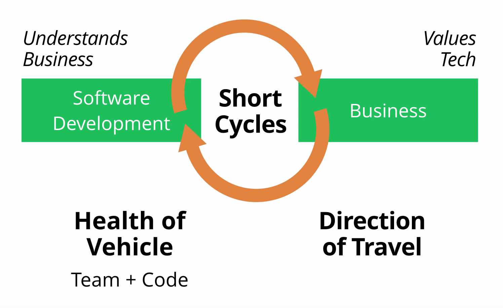

We often try to get better by following the latest tech trends such as microservices, serverless and the like.
These are mostly technical efforts to improve.
However, what often makes the key difference is:

# Technical Excellence

A great entry point is the follwing 30mins talk by Martin Fowler:

https://www.youtube.com/watch?v=Avs70dZ3Vlk

He points out pretty clearly the key aspects of building and maintaining an organization that aims for technical excellence in the long run:

## [What does tech excellence look like?](https://www.youtube.com/watch?v=Avs70dZ3Vlk) by Martin Fowler
* **Improve IT performance**
  * Reduce cycle time (i.e. frequent and fast deployments)
  * Focus on reducing mean time to repair (MTTR) instead of mean time between failure (MTBF)
* **Do continuous delivery**
  * Version control
  * Continuous integration
  * Test automation
  * Deployment automation
* **Carefully structure your teams**
  * You cannot avoid silos, humans will always form silos
    * However, you can control the borders of these silos, so they support your business
  * A team must be small, business-oriented, and autonomous
  * Teams should be as long-term and stable as possible
* **Establish trustful environment**
  * Ask for help
  * Share knowledge
  * Learning > Blame
  * Home for the evening
  * No toxic people
  * Integrity
* **Led by technology**
  * Peer recognition > Manager recognition
  * Value technical skill (to same degree as other skills like management etc.)
  * Continuous learning
  * Engage with technology community
  * No golf-course purchases
* **Focus on getting excellent in your strategic software (competitive advantage)**, not utility (payroll, HR)
  * Technical excellence is important in general, but you must prioritize because your resources are limited

### Efficient collaboration between software development and business

----

More stuff on roles, management vs. technical and more:

## [The architect elevator - visiting the upper floors](https://martinfowler.com/articles/architect-elevator.html) by Gregor Hohpe
* TODO

## [The engineer/manager pendulum](https://charity.wtf/2017/05/11/the-engineer-manager-pendulum/) by @mipsytipsy and tweets by @sarahmei
* Drop the idea that only managers get career progression.
* Drop the idea you have to choose a "lane" and grow old there.
* The best individual contributors are the ones who have done time in management.
* **The best technical leaders in the world are often the ones who do both (technical and management).** Back and forth. Like a pendulum.
* There are lots of people who do both well - **but serially. Not simultaneously.**
* ... **hybrid manager+tech lead. This is an unstable combination,** because your engineering skills and context-sharpness are decaying the longer you do it.
* You can only really improve at one of these things at a time: engineering or management.
* Management is highly interruptive, and great engineering - where you're learning things - requires blocking out interruptions. You can't do these two opposite things at once. As a manager, it is your job to be available for your team, to be interrupted. It is your job to choose to hand off the challenging assignments, so that your engineers can get better at engineering.
* A tech lead is a manager ... but their first priority is achieving the task at hand, not grooming and minding the humans who work on it. They still need the full manager toolset. ... management work, from the slightly shifted perspective of "Get Thing X Done" not "care for these people".
* Tech is the easy part, herding humans is the harder part.
* **Management is not a promotion, management is a change of profession.**
* Becoming a manager is not a promotion - it's a lateral move onto a parallel track. You're back at junior level in many key skills.
* ... it leads to so many people managing even though they hate managing and have no business managing, and also starves the senior engineers pool of the great mentors and elder wizards we need.
* Do [management] as long as it makes you happy, and the people around you happy. Then stop. Go back to building things.
